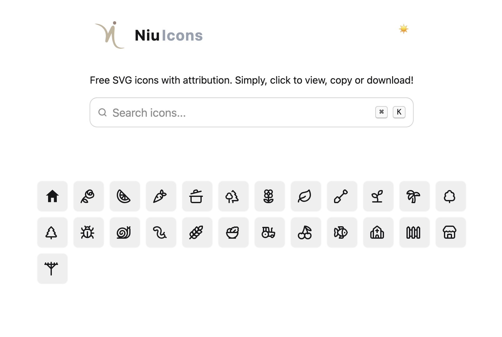

# Niu Icons - Free SVG Icon Library for Agriculture & Rural Development

**Niu Icons** is a free and open collection of SVG icons designed specifically around themes of **rural development**, **farming and agriculture**, **sustainable development**, and the **cross-section between technology and local communities**.

Built for creators, developers and changemakers who work on meaningful projects that aim to bridge the digital divide and build a better world.



## Features

- Handcrafted icons tailored for real-world impact
- Rural development, farming, tech-for-good themes
- Raw SVG – Copy and paste directly into HTML
- React-ready (can be turned into components)
- Light/Dark mode
- Search, filter, copy and download easily

## Getting Started

### 1. Clone the Repo

```bash
git clone https://github.com/glenhayoge/niu-icons.git
cd niu-icons
npm install
npm run dev
```

### 2. Add Your Own Icons

Place new `.svg` files into the `public/icons/` folder. Make sure the file names match the icon names (e.g., `cooking-pot.svg` → name: `"cooking-pot"`).

### 3. Build for Production

```bash
npm run build
```

## Roadmap

- Categories (Agro-tech, Community, Tools, Infrastructure, etc.)
- Icon submission portal
- Publish as React and Vue components on npm
- Support for Figma plugin export

## Attribution

If you use these icons, please include:

> Icons by [Glen Hayoge - Niu Icons](https://github.com/glenhayoge/niu-icons)

##  About the Author

Made with 💚 by **Glen Hayoge** — passionate about tech, agriculture and building tech tools for rural development.  
[GitHub](https://github.com/glenhayoge)

## License

Free to use under the [Attribution License](./LICENSE). Please credit **Niu Icons** in your project.

Temporarily using lucide icons as placeholders. 

---
